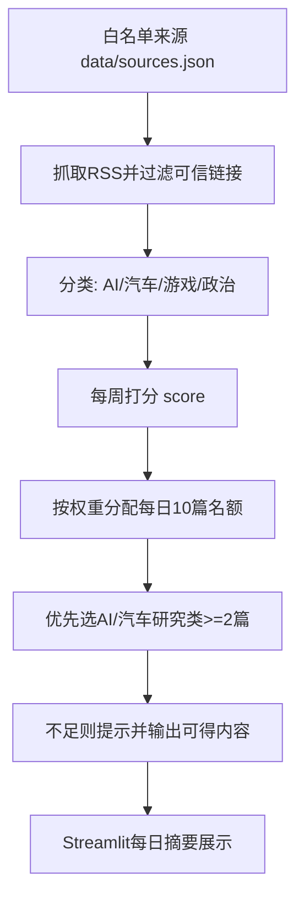

# news-go

本仓库目前有两条线：

- **Go API（工程主线）**：抓取 RSS、入库、提供接口与简易浏览 UI（`http://localhost:8080/`）。
- **Python Streamlit（策略线）**：实现“每周来源打分 + 每日10篇加权摘要”策略（`streamlit run app.py`）。

如果你的目标是你提的那套“来源权威性评分 + 每日10篇加权推送”，请直接使用 **Python Streamlit** 这条线。

---

## 最简单部署（你只需要这两条）

### macOS / Linux

```bash
bash scripts/deploy_simple.sh
```

### Windows PowerShell

```powershell
powershell -ExecutionPolicy Bypass -File .\scripts\deploy_simple.ps1
```

执行后会自动：
1. 安装 Python 依赖；
2. 生成今日摘要 `data/daily_digest.json`；
3. 启动 Go 服务（`http://localhost:8080/`）。

8080 首页可直接看到来源评分表（评分、今日配额、周产量、研究占比、覆盖度）。

若当日抓取失败，会自动保留上一次成功摘要，避免页面空白。

另外系统不会再使用示例假新闻填充页面：看不到真实新闻时会明确显示“暂无可展示新闻”。

如果第一次部署就为空，请先确认网络是否能访问 `data/sources.json` 里的 RSS。

如果你已经配好 Python 环境，也可以直接：

```bash
make run-all
```

---

## 你的初始诉求是否满足（当前版本）

✅ 已满足（在 `src/news_pipeline.py` + `app.py`）：

1. **每周给来源打分（影响因子风格）**：
   - 每 7 天更新一次分数并缓存到 `data/weights.json`。
2. **根据权重分配每日摘要名额**：
   - 每日总量 10 篇。
   - 高权重来源可获得 2~3 篇；低权重可能 0 篇。
3. **按领域过滤**：
   - 仅收录 `汽车 / AI / 游戏 / 政治`。
4. **研究类约束**：
   - 优先保证至少 2 篇“AI/汽车前沿研究”新闻；若当天不足会在 UI 明确提示。
5. **可信度基本审查**：
   - 仅从你认可的白名单来源（`data/sources.json`）采集。

---

## 算法原理（为什么这么做）

我们用一个 **Impact-Factor-like** 的可解释打分：

- `base_authority`：你对来源的先验权威评分（人工设定）。
- `weekly_volume`：近 7 天该来源产出量（log 平滑）。
- `research_ratio`：近 7 天研究类新闻占比。
- `topic_coverage`：近 7 天覆盖 4 个目标领域的广度。

### 评分公式

\[
score = base\_authority \times \left(1 + 0.45\cdot\log(1+weekly\_volume) + 0.35\cdot research\_ratio + 0.20\cdot topic\_coverage\right)
\]

### 为什么用这套公式

- `base_authority` 保证“权威媒体先验”被保留；
- `log(volume)` 防止“纯刷量”碾压；
- `research_ratio` 奖励研究型内容；
- `topic_coverage` 奖励领域覆盖均衡；
- 全部特征可解释，可在 UI 直接展示，便于人工审计。

### 流程图（图像化展示）



---

## 每日10篇如何分配

- 总名额固定 10。
- 按 score 比例分配，单源上限 3 篇。
- 低分源可分到 0 篇。
- 然后从“当天新闻”中按来源与时间优先级选择。

> 这意味着不是“每个来源都必须有新闻”，而是“高权重多拿、低权重可不拿”。

---

## 进阶运行（手动分步）

### A) 运行策略版 UI（推荐看结果）

```bash
python -m venv .venv
source .venv/bin/activate  # Windows: .venv\Scripts\activate
pip install -r requirements.txt
streamlit run app.py
```

打开：`http://localhost:8501`

### B) 生成策略摘要文件（供 Go UI / API 读取）

```bash
python -m src.digest_job
```

会生成：`data/daily_digest.json`（建议用系统定时任务每天跑一次）。

### C) 运行 Go API（工程服务）

```bash
cp .env.example .env
go run ./cmd/api   # Windows 同样可用
```

打开：`http://localhost:8080/`

- 根页面会优先读取策略摘要接口 `GET /v1/digest`。
- 若当天未生成摘要文件，会自动回退展示普通新闻列表。

---

## 关键文件

- `src/news_pipeline.py`：每周评分、每日10篇分配、研究类约束。
- `app.py`：可视化展示权重、名额、今日摘要。
- `data/sources.json`：白名单来源与基础权威分。
- `data/weights.json`：每周评分缓存。
- `src/digest_job.py`：生成 `data/daily_digest.json` 的每日任务脚本。

---

## 局限与后续建议

当前“真实性”采用白名单 + 基础规则过滤。若要更严格，建议后续增加：

1. 多源交叉印证（同主题至少2家权威源）；
2. 事实核查源（如官方通告）比对；
3. LLM + 检索证据链评分（附证据链接）。
