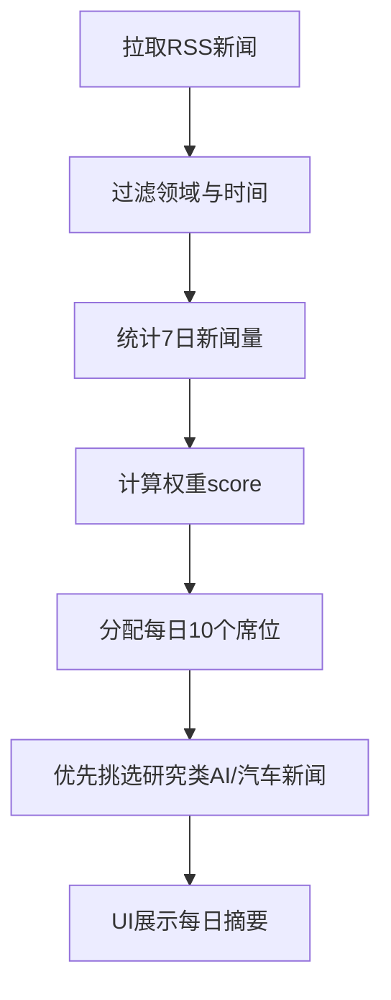

# news-go

一个使用 Go 构建的新闻聚合服务（P1 已完成，P2 已开始）。

## 当前能力

- 可运行 HTTP 服务：`cmd/api`
- 接口：
  - `GET /healthz`
  - `GET /readyz`
  - `GET /v1/articles?limit=&offset=&q=&source=&from=&to=`（`from/to` 需为 RFC3339，否则返回 400）
  - `GET /v1/articles/{id}`
- RSS 抓取：启动抓取 + 定时同步（可配置间隔/重试）
- 存储：优先 SQLite，不可用时回退内存仓储
- 去重：`url_hash` 唯一约束 + upsert
- 结构化请求日志：包含 method/path/status/duration/request_id

## 快速开始

```bash
cp .env.example .env
make run
```

## 配置

- `HTTP_ADDR`：监听地址
- `DB_PATH`：SQLite 文件路径
- `RSS_FEED_URL`：RSS 源
- `RSS_SYNC_INTERVAL_SEC`：定时同步间隔（秒）
- `RSS_MAX_RETRIES`：单次同步失败重试次数

## 常用命令

```bash
make test
make vet
make fmt
```
# News-Go（每日新闻评分与摘要）

News-Go 是一个面向中文用户的每日新闻评分与摘要工具：
- 自动抓取国内外权威新闻源（RSS）。
- 每周自动评估新闻源权威性并生成权重。
- 每日按权重分配 10 篇摘要，确保包含汽车/AI 前沿研究类新闻。
- 提供简洁 Streamlit UI，一键部署。

> **定位**：可直接部署到 GitHub 的开源项目，面向非技术用户的 Windows 运行手册。

---

## ✨ 功能概览

- **权威源评分**：按“影响因子”思路，每周更新权重。
- **每日 10 篇摘要**：高权重来源更多席位，低权重来源少或不收录。
- **领域过滤**：只保留汽车 / AI / 游戏 / 政治类新闻；研究类新闻优先。
- **UI 展示**：权重榜 + 今日新闻摘要。

---

## 🔍 评分算法说明

### 核心思路
借鉴学术界“影响因子”概念：**权威度 × 近期活跃度 = 影响权重**。

### 公式

```
score_i = base_authority_i × (1 + ln(1 + volume_i))
```

- `base_authority_i`：人工赋予的权威基础分（0~1）。
- `volume_i`：过去 7 天内可用新闻数量。
- `ln(1 + volume)`：对新闻量进行对数压缩，避免“刷量”支配排名。

### 为什么合理
- **权威度先验**：来源是否权威不能只看数量，需先验评估。
- **活跃度校正**：近期活跃来源应获得更多展示机会。
- **对数函数稳健**：减少过度偏向高产媒体的问题。

### 流程图



---

## ✅ 每日摘要策略

1. **计算权重** → 生成每个来源的新闻配额。
2. **保证研究类新闻**：至少 2 篇 AI/汽车研究类新闻。
3. **按来源配额选取**：高权重来源可获得 2~3 篇，低权重 0 篇。

> 若某领域当日无高质量内容，可不强行纳入。

---

## 📦 项目结构

```
news-go/
├─ app.py                 # Streamlit UI
├─ src/news_pipeline.py   # 抓取/评分/筛选逻辑
├─ data/sources.json      # 新闻源配置
├─ data/weights.json      # 每周权重缓存
└─ requirements.txt
```

---

## 🚀 Windows 一键部署（小白版）

### 1. 安装 Python
- 前往 https://www.python.org/downloads/ 下载并安装 Python 3.10+。
- 安装时勾选 “Add Python to PATH”。

### 2. 下载项目
```bash
git clone <你的GitHub仓库地址>
cd news-go
```

### 3. 安装依赖
```bash
pip install -r requirements.txt
```

### 4. 运行 UI
```bash
streamlit run app.py
```

浏览器将自动打开 `http://localhost:8501`。

---

## 🧩 自定义新闻源
编辑 `data/sources.json`：
- `rss`：RSS 地址
- `base_authority`：权威基础分（0~1）
- `topics`：可涵盖领域

---

## ⚠️ 免责声明
- 项目基于 RSS 抓取，新闻真实性依赖于来源可信度与新闻源更新。
- 建议根据实际需求调整权威分数与领域关键词。

---

## 📝 下一步建议
- 引入数据库持久化与全文解析。
- 使用更精细的 NLP 分类与可信度检测。
- 支持多语言摘要与推送（邮件/飞书/微信）。
